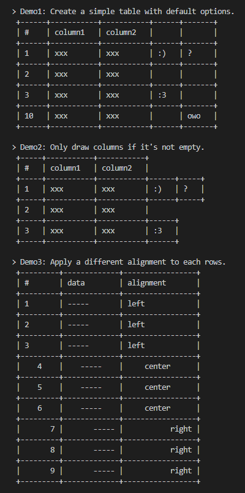

# terminal-char-table
a simple javascript (node.js) library for drawing ascii tables in the terminal and console.



**WARNING:**<br>
Since version above 1.1.0, `'CharTable'` object was not as a child of the `'terminal'` namespace,<br>
So you can create a `'CharTable'` object instance directly after `'require()'` has returned,<br>
In addition, `'terminal.wcswidth'` and `'terminal.wcwidth'` has been also removed.
> If you are the first time use this library, can be ignore this warning.
# Install & Usage
- Install package from npm.
```
npm install terminal-char-table
```
- Import package in your code.
```js
const CharTable = require('terminal-char-table');
```
- Create instance of `CharTable` object.
> You can pass an optional integer to the constructor.
>
> The size of the value controls how many compact of the table cells.
```js
let table = new CharTable(5);
```
- Fill your table content.
> method `insert()` and `append()` can insert a new row at the top or bottom of the table.
```js
table.append(['1', 'xxx', 'xxx', ':)']);
table.append(['2', 'xxx', 'xxx']);
table.append(['3', 'xxx', 'xxx']);
table.insert(['#', 'column1', 'column2']);
```
> or you can use `from()` method:
```js
table.from([

	['#', 'column1', 'column2'],
	['1', 'xxx', 'xxx', ':)'],
	['2', 'xxx', 'xxx'],
	['3', 'xxx', 'xxx']
]);
```
- Output your table.
> method `string()` has two optional arguments:
>
>`left_indentation (int)` and `first_line_break (bool)`
```js
console.log(table.string(1, false));
```
> or you can use `lines()` method:
```js
let lines = table.lines();
for (let line of lines) { console.log(line); }
```
- You will see your tables in the terminal like this:
```
+-----------+-----------------+-----------------+------------+
|     #     |     column1     |     column2     |            |
+-----------+-----------------+-----------------+------------+
|     1     |       xxx       |       xxx       |     :)     |
+-----------+-----------------+-----------------+------------+
|     2     |       xxx       |       xxx       |            |
+-----------+-----------------+-----------------+------------+
|     3     |       xxx       |       xxx       |            |
+-----------+-----------------+-----------------+------------+
```
# Note
- The complete methods can be found in `module.js`
- See `test.js` and run test using `npm test` command.
# License
- The MIT License (MIT)
- Original Author: https://github.com/hustcc/word-table